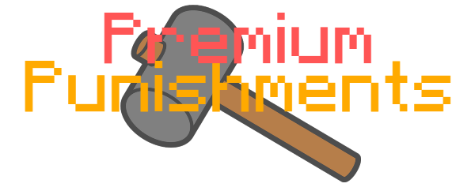
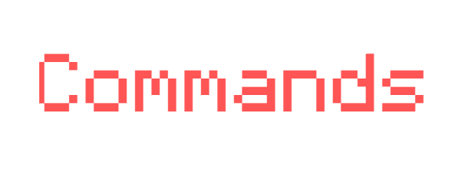

[<h1 align="center">![Contributors][contributors-shield]][contributors-url] [![Forks][forks-shield]][forks-url] [![Stargazers][stars-shield]][stars-url] [![Issues][issues-shield]][issues-url] [![Apache 2.0 License][license-shield]][license-url]</h1>

<br />
<p align="center">
  <a href="https://github.com/Exortions/PremiumPunishments-3.0">
    
  </a>
</p>

<h3 align="center">Premium Punishments</h3>
<p align="center">
    A lightweight, easy to use plugin that allows you to manage punishments on your Minecraft server. From bans to warns, Premium Punishments is equip to handle anything that staff may need while moderating a server.
    <br />
    <a href="https://github.com/Exortions/PremiumPunishments-3.0"><strong>Explore the project »</strong></a>
    <br />
    <br />
    <a href="https://github.com/Exortions/PremiumPunishments-3.0">View Spigot</a>
    ·
    <a href="https://github.com/Exortions/PremiumPunishments-3.0/issues">Report Bug</a>
    ·
    <a href="https://github.com/Exortions/PremiumPunishments-3.0/issues">Request Feature</a>
</p>

<details open="open">
  <summary><h2 style="display: inline-block">Table of Contents</h2></summary>
  <ol>
    <li>
      <a href="#about-the-project">About The Project</a>
      <ul>
        <li><a href="#built-with">Built With</a></li>
      </ul>
    </li>
    <li>
      <a href="#getting-started">Getting Started</a>
      <ul>
        <li><a href="#prerequisites">Prerequisites</a></li>
        <li><a href="#installation">Installation</a></li>
      </ul>
    </li>
    <li><a href="#roadmap">Roadmap</a></li>
    <li><a href="#contributing">Contributing</a></li>
    <li><a href="#license">License</a></li>
    <li><a href="#acknowledgements">Acknowledgements</a></li>
  </ol>
</details>

## About The Project

A lightweight, easy to use plugin that allows you to manage punishments on your Minecraft server. From bans to warns, Premium Punishments is equip to handle anything that staff may need while moderating a server.

### Features

1. Fully customizable configuration file
2. Lightweight architecture that allows the server to run smoothly along with Premium Punishments
3. Built-in MySQL support that allows the server to make use of databases.
4. Optional staff-chat plugin that allows staff to converse privately.

### Commands
<div align="center"></div>

* /premiumpunishments ban - Ban a player with a custom duration and message. Banning a player will disconnect them from the server and display to them the custom message, as well as prevent them from re-connecting to the server until the duration has expired, or they have been manually unbanned.
* /premiumpunishments unban - Unbans a player. Unbanning a player will revoke all ban punishments on them, and will allow them to join the server if they were banned before unbanning them.
* /premiumpunishments mute - Mute a player with a custom duration. Muting a player prevents them from sending chat messages. The player will remain muted upon disconnecting and re-connecting to the server.
* /premiumpunishments kick - Kick a player with a custom message. Kicking a player will disconnect them from the server and display to them the custom message.
* /premiumpunishments warn - Warn a player with a custom message. Warning a player will send them the custom message as a formal warning.
* /premiumpunishments freeze - Freeze a player with a custom duration. Freezing a player prevents them from moving, breaking blocks, placing blocks, interacting with the world, and running chat commands. The player will remain frozen upon disconnecting and re-connecting to the server.
* /premiumpunishments unfreeze - Unfreeze a player. Unfreezing a player will allow the player to continue playing on the server like normal before they were frozen.
* /premiumpunishments note - Notes allow staff to make notes on different players. They can remove, add, and list notes they have on a player.

### Built With

* [Spigot API](https://www.spigotmc.org/)
* [Plugin Utils](https://www.github.com/Exortions/PluginUtils)
* [Maven](https://maven.apache.org/)

## Getting Started

To add Premium Punishments to your Minecraft server, follow these simple steps.

### Prerequisites

* A Spigot Minecraft server
  ```
  https://www.spigotmc.org/
  ```

### Installation

1. Download the latest jar file at the
   spigot page.
2. Drag and drop the jar file into your Minecraft server's plugins directory.

## Roadmap

See the [open issues](https://github.com/Exortions/PremiumPunishments-3.0/issues) for a list of proposed features (and known issues).

## Contributing

Contributions are what make the open source community such an amazing place to learn, inspire, and create. Any contributions you make are **greatly appreciated**.

1. Fork the Project
2. Create your Feature Branch (`git checkout -b feature/AmazingFeature`)
3. Commit your Changes (`git commit -m 'Add some AmazingFeature'`)
4. Push to the Branch (`git push origin feature/AmazingFeature`)
5. Open a Pull Request

## License

Distributed under the Apache 2.0 License. See `LICENSE` for more information.

## Acknowledgements

* [Spigot API](https://www.spigotmc.org/)
* [Plugin Utils](https://www.github.com/Exortions/PluginUtils)
* [Maven](https://maven.apache.org/)
* [README Template](https://github.com/othneildrew/Best-README-Template)
* [Punishment for Inspiration](https://dev.bukkit.org/projects/punishment)

[contributors-shield]: https://img.shields.io/github/contributors/Exortions/PremiumPunishments-3.0.svg?style=for-the-badge
[contributors-url]: https://github.com/Exortions/PremiumPunishments-3.0/graphs/contributors
[forks-shield]: https://img.shields.io/github/forks/Exortions/PremiumPunishments-3.0.svg?style=for-the-badge
[forks-url]: https://github.com/Exortions/PremiumPunishments-3.0/network/members
[stars-shield]: https://img.shields.io/github/stars/Exortions/PremiumPunishments-3.0.svg?style=for-the-badge
[stars-url]: https://github.com/Exortions/PremiumPunishments-3.0/stargazers
[issues-shield]: https://img.shields.io/github/issues/Exortions/PremiumPunishments-3.0?style=for-the-badge
[issues-url]: https://github.com/Exortions/PremiumPunishments-3.0/issues
[license-shield]: https://img.shields.io/github/license/Exortions/PremiumPunishments-3.0.svg?style=for-the-badge
[license-url]: https://github.com/Exortions/PremiumPunishments-3.0/blob/master/LICENSE